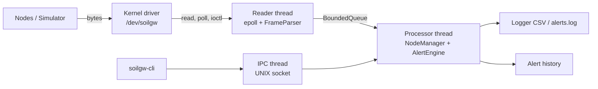
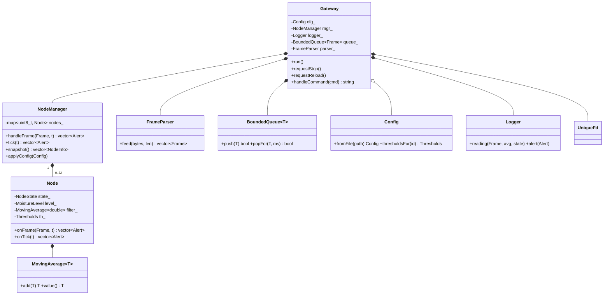
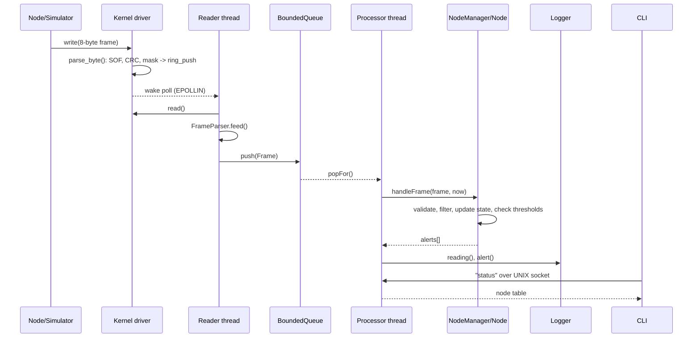
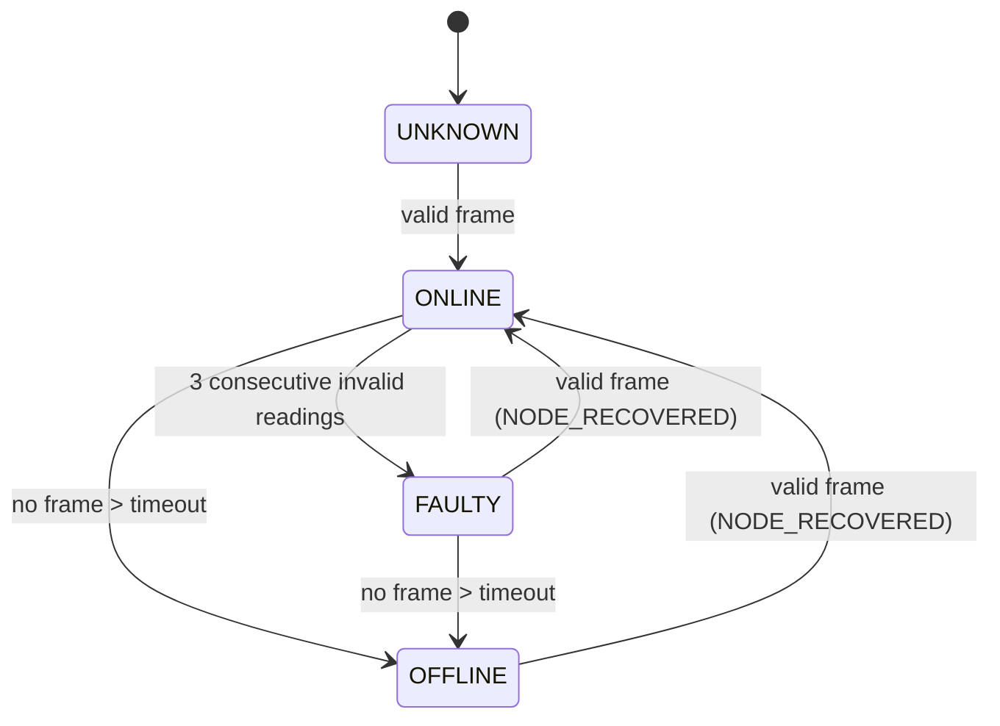
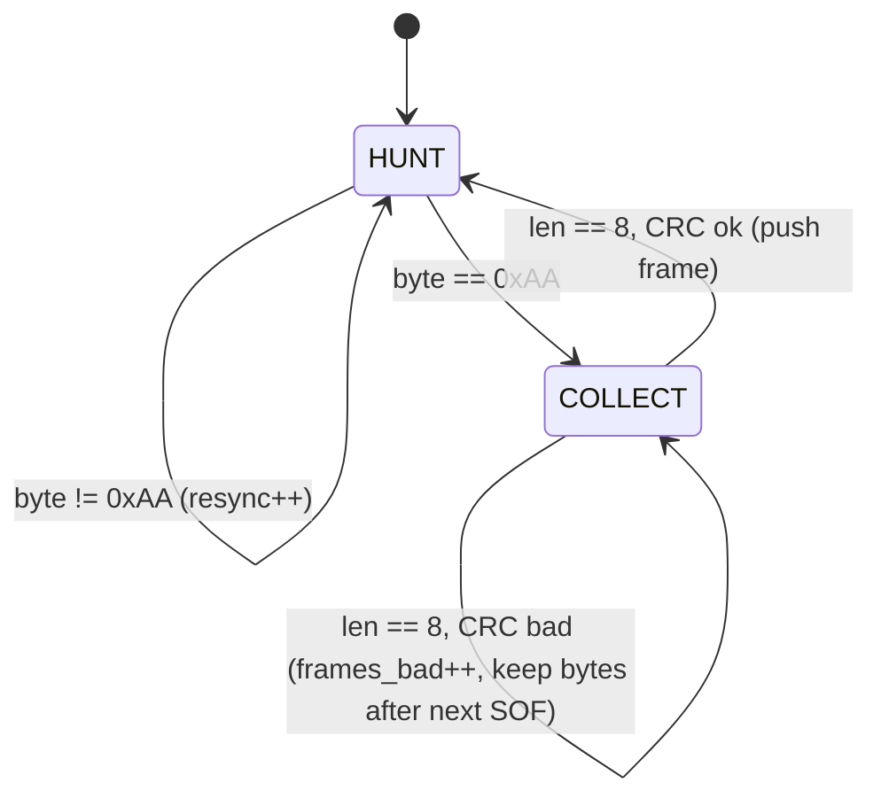

# Stage 3 - System Design & Architecture

## 1. Architecture
```
 Field nodes 1..N                        KERNEL SPACE                         USER SPACE
 +-----------+   UART/RS-485    +------------------------+        +-------------------------------+
 | soil node | ---------------> | soilgw.ko              |        | soilgwd                       |
 +-----------+   or simulator   |  parse_byte() FSM      | read   |  reader thread (epoll)        |
 | soil node | ---- write() --> |  CRC-8 + node filter   | poll   |    -> FrameParser             |
 +-----------+                  |  ring buffer (256)     | -----> |    -> BoundedQueue<Frame>     |
                                |  wait queue, spinlock  | ioctl  |  processor thread             |
                                |  /proc/soilgw          |        |    -> NodeManager -> Node     |
                                +------------------------+        |    -> Logger, alert history   |
                                                                  |  ipc thread (UNIX socket)     |
                                                                  +---------------+---------------+
                                                                                  | status/alerts/stats
                                                                       soilgw-cli, logs/*.csv|log
```


## 2. Components and responsibilities
| Component | Responsibility |
|---|---|
| `soilgw.ko` | byte framing, CRC check, node mask, ring buffer, blocking/poll reads, stats, /proc |
| `protocol` | frame encode/decode, CRC-8, `FrameParser` (same algorithm as driver) |
| `Node` | validation, moving average, state machine, hysteresis alerts, lost-frame count |
| `NodeManager` | thread-safe registry, node creation, per-node thresholds, snapshots, live reconfiguration |
| `Config` | key=value parser with validation and per-node overrides |
| `Logger` | thread-safe CSV/alert files + syslog/stderr diagnostics |
| `Gateway` | owns the 3 threads, device/socket setup, signal-safe stop/reload |
| `UniqueFd`, `BoundedQueue<T>`, `MovingAverage<T>` | RAII fd, non-blocking-producer queue, generic filter |

## 3. Concurrency model
- Reader -> processor decoupled by `BoundedQueue` (mutex + condvar). Producer never blocks; drops are counted (`queue_dropped`).
- `NodeManager` has one mutex; `Logger` one mutex; alert history one mutex. No nested locking, so no deadlock.
- Signals: handlers only set an atomic flag and write to an `eventfd` (async-signal-safe); every thread polls that eventfd.
- Kernel: single spinlock (`irqsave`) guards ring + parser + stats; `copy_to/from_user` done outside the lock.

## 4. Data structures
```c
struct soilgw_dev { cdev; spinlock_t lock; wait_queue_head_t rq;
                    u8 ring[256][8]; head, tail, count;     /* ring buffer */
                    u8 pbuf[8]; plen;                        /* frame under assembly */
                    u32 mask; struct soilgw_stats st; };
```
```cpp
struct Frame      { uint8_t node, seq; double moisture; uint16_t battery_mv; };
struct Thresholds { double low, high, hysteresis; };
struct Alert      { time_t ts; uint8_t node; AlertType type; std::string message; };
struct NodeInfo   { id, state, level, raw, average, battery_mv, frames, lost, last_seen_ms; };
std::map<uint8_t, std::unique_ptr<Node>> nodes_;   // NodeManager
```
Wire frame: `AA | node | seq | moist_hi | moist_lo | batt_hi | batt_lo | crc8`.

## 5. UML

### 5.1 Class diagram


### 5.2 Sequence diagram - reading to alert


### 5.3 State machine - Node

Moisture-level sub-machine (hysteresis): `NORMAL -> LOW` when avg < low; `LOW -> NORMAL` when avg >= low+hyst;
`NORMAL -> HIGH` when avg > high; `HIGH -> NORMAL` when avg <= high-hyst.

### 5.4 Driver framing state machine


## 6. Implementation plan
1. Protocol header + CRC (shared) -> 2. kernel driver + loopback test -> 3. parser + unit tests ->
4. Node/NodeManager + tests -> 5. Gateway threads/epoll/IPC -> 6. logger, CLI -> 7. simulator + integration test ->
8. sanitizers, performance, documentation.

## 7. Development environment
Ubuntu 22.04/24.04 (VM or Raspberry Pi OS), `build-essential`, `linux-headers-$(uname -r)`, `git`, optional `valgrind`,
`clang-format`. Build: `make`; tests: `make test`, `make integration`; driver: `make driver`.
Sanitizers: `make clean && make CXXFLAGS="-std=c++17 -g -O1 -pthread -fsanitize=thread"`.

## 8. Git strategy
- `main`: stable, tagged at each stage (`v0.1-stage3`, `v0.4-stage4`, `v0.5-stage5`, `v1.0`).
- `develop`: integration branch. `feature/<name>` branches merged via pull request/`--no-ff`.
- Commit style: `type(scope): message` (feat, fix, test, docs, refactor, perf, chore).
- Run `make test` before each merge. `scripts/git_init.sh` creates the repository and branches.
- Progress tracking: `docs/04_progress_log.md` updated at every stage, one entry per working session.
